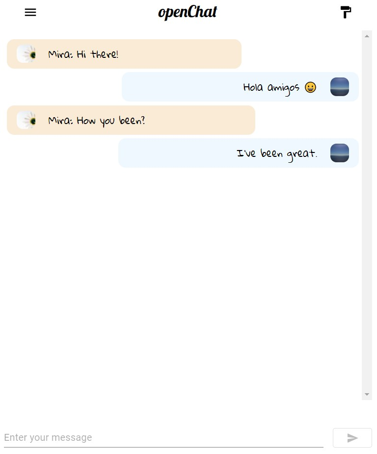

# openChat App

This app lets logged in users to chat among themselves, built with React and Firebase API. Users can also signup for a new account in-order to use the app.
Here are some of the images of the app:

 

